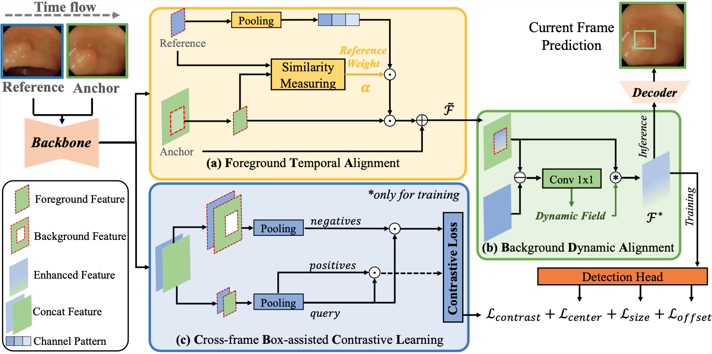

## [YONA: You Only Need One Adjacent Reference-frame for Accurate and Fast Video Polyp Detection](https://arxiv.org/abs/2306.03686)
by Yuncheng Jiang, Zixun Zhang, Ruimao Zhang, Guanbin Li, Shuguang Cui, and Zhen Li

## Introduction
 
Accurate polyp detection is essential for assisting clinical rectal cancer diagnoses. Colonoscopy videos contain richer information than still images, making them a valuable resource for deep learning methods. However, unlike common fixed-camera video, the camera-moving scene in colonoscopy videos can cause rapid video jitters, leading to unstable training for existing video detection models. In this paper, we propose the YONA (You Only Need one Adjacent Reference-frame) method, an efficient end-to-end training framework for video polyp detection. YONA fully exploits the information of one previous adjacent frame and conducts polyp detection on the current frame without multi-frame collaborations. Specifically, for the foreground, YONA adaptively aligns the current frame’s channel activation patterns with its adjacent refer- ence frames according to their foreground similarity. For the background, YONA conducts background dynamic alignment guided by inter-frame difference to eliminate the invalid features produced by drastic spatial jitters. Moreover, YONA applies cross-frame contrastive learning dur- ing training, leveraging the ground truth bounding box to improve the model’s perception of polyp and background. Quantitative and quali- tative experiments on three public challenging benchmarks demonstrate that our proposed YONA outperforms previous state-of-the-art competi- tors by a large margin in both accuracy and speed.

## Clone repository

```shell
git clone https://github.com/yuncheng97/YONA.git
cd YONA/
```

## File tree
```
YONA                         

```

## Download dataset

The training and testing datasets come from public colonoscopy benchmarks: 'SUNSEG', 'LDPolypVideo', 'CVC-VideoClinicDB' and 'PolypGen'. Download these datasets and unzip them into `data` folder.

- [SUNSEG](http://sundatabase.org/)
- [LDPolypVideo](https://github.com/dashishi/LDPolypVideo-Benchmark)
- [CVC-VideoClinicDB](https://giana.grand-challenge.org/) (*you need contact the author to get the access permission*)

## Prerequisites

- [Python 3](https://www.python.org/)
- [Pytorch 1.11](http://pytorch.org/)
- [OpenCV 4.7](https://opencv.org/)
- [Numpy 1.23](https://numpy.org/)
- [Albumentations 1.3.1](https://github.com/albumentations-team/albumentations)


## Training
Set your own configuration before training. Make sure you set the right dataset path in '--data_path' and save path in '--save_path'.
```shell
    python train.py

    or

    bash train.sh
```

## Citation
- If you find this work is helpful, please cite our paper
```
@article{jiang2023ecc,
  title={ECC-PolypDet: Enhanced CenterNet With Contrastive Learning for Automatic Polyp Detection},
  author={Jiang, Yuncheng and Zhang, Zixun and Hu, Yiwen and Li, Guanbin and Wan, Xiang and Wu, Song and Cui, Shuguang and Huang, Silin and Li, Zhen},
  journal={IEEE Journal of Biomedical and Health Informatics},
  year={2023},
  publisher={IEEE}
}
```